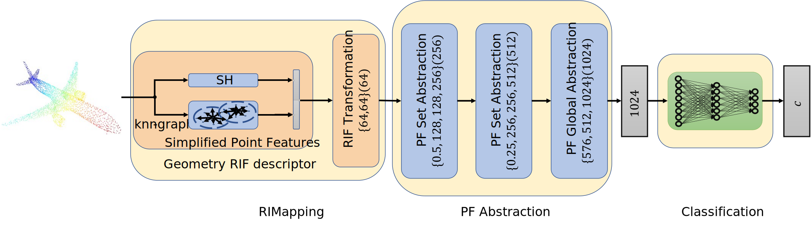

## Deep Hierarchical Rotation Invariance Learning with Exact Geometry Feature Representation for Point Cloud Classification

#### [[paper]](https://www.researchgate.net/publication/351884845_Deep_Hierarchical_Rotation_Invariance_Learning_with_Exact_Geometry_Feature_Representation_for_Point_Cloud_Classification)[[project page]](https://linjianjie.github.io/rif/)	
 
### Introduction

The proposed neural network architecture aims at addressing the problem of rotation invariant point cloud classification problem. Its based on our ICRA2021 [[paper]](https://www.researchgate.net/publication/351884845_Deep_Hierarchical_Rotation_Invariance_Learning_with_Exact_Geometry_Feature_Representation_for_Point_Cloud_Classification)
more details please refers to our paper

### Usage
#### 1) Prerequisite
1. Install dependencies via `pip3 install -r requirments.txt`.
2. Follow [this guide](http://open3d.org/docs/getting_started.html) to install Open3D for point cloud I/O.
3. Download dataset from [[Modelnet40]](https://shapenet.cs.stanford.edu/media/modelnet40_ply_hdf5_2048.zip)

#### 2) Prepearing the Spherical Harmonics Dataset
1. creating the spherical harmonics dataset in the folder 
    ```
    python basic/createDataset.py --maxdegree 20   --train Z S --test Z S  --datafolder SH_D20
    ```
   1. by setting the variable ```maxdegree``` to approximate the spherical harmonic funtion
   2. by setting the rotation type in Z or S rotate the point Cloud
   3. by setting the pertubation ```pertubation``` to add the pertubation in the dataset
2. the configuration is located in config/RIFConfig.yaml
   
### 3) train the RIF model by using 
for example
```
python3 cls/train_rif.py --maxdegree 20 --datamaxdegree 20 --best_model_name best_model_sph  --trainRot Z --testRot Z --BatchSize 32  --epoch 150 --dataSource  SH_D20 --model rifNet --dataset_type sphericalModel40
``` 
for evaluating the case of Z/Z with the SphericalHarmonics Dataset

for evaluating the DGCNN or PointNet, the ```--model dgcnn``` or ```--model pointnet``` and ```--dataset_type modelnet40``` 
### Citation
If you find our work useful for your research, please cite:
```
@InProceedings{Lin2021RIF,
  author    = {Lin, Jianjie and Rickert, Markus and Knoll, Alois},
  booktitle = {2021 IEEE International Conference on Robotics and Automation (ICRA)},
  title     = {Deep Hierarchical Rotation Invariance Learning with Exact Geometry Feature Representation for Point Cloud Classification},
  year      = {2021},
  pages     = {9529-9535},
  doi       = {10.1109/ICRA48506.2021.9561307},
}
```

### License
This project Code is released under the GPLv2 License (refer to the LICENSE file for details).


